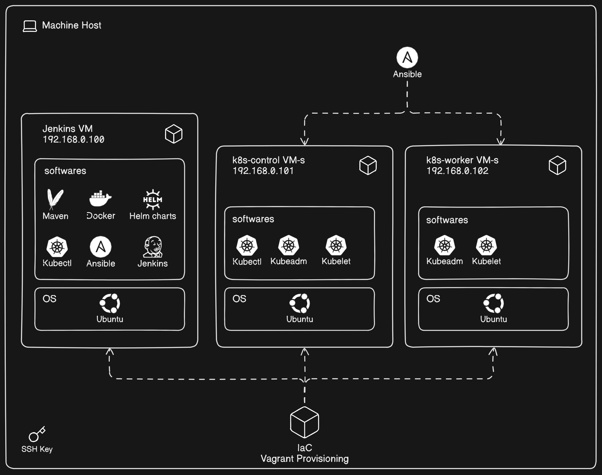
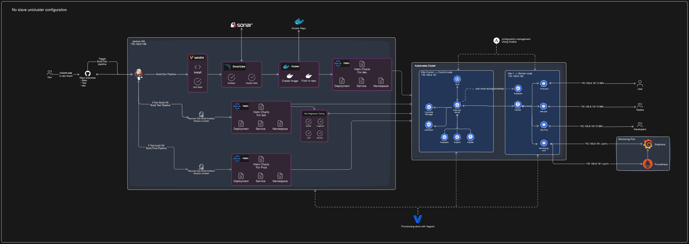

# Overview
This repository contains a DevOps project created for learning purposes, aimed at building a cost-free, resource-efficient infrastructure capable of running on low-spec host machines to support an unrestricted learning environment.

The project provisions three virtual machines, demonstrating Infrastructure as Code (IaC) principles while efficiently managing limited local resources. This setup serves as a hands-on platform for exploring CI/CD practices, deployment strategies and monitoring tools such as Vagrant, Ansible, Jenkins, Maven, SonarQube, Docker, Helm, Kubernetes, Prometheus, and Grafana.

The project also includes a CI/CD pipeline implemented as a series of Jenkins jobs, designed to automate the deployment lifecycle across Development, Testing, and Production environments. 

All setup instructions and documentation for comprehensive guidance on configuring and deploying the project are available in the [**doc folder**](https://github.com/Cedric-Hj/DevOps-CICD-WebApp/tree/main/Doc).

## Technology Stack Overview
<table>
  <tr>
    <td align="center">
       
      Ansible
    </td>    
    <td align="center">
       
      Jenkins
    </td>
    <td align="center">
       
      Maven
    </td>
    <td align="center">
       
      SonarQube
    </td>
    <td align="center">
       
      Docker
    </td>
    <td align="center">
       
      Kubernetes
    </td>
    <td align="center">
       
      Helm
    </td>
    <td align="center">
       
      Grafana
    </td>
    <td align="center">
       
      Prometheus
    </td>
    <td align="center">
       
      Git
    </td>
    <td align="center">
       
      Python
    </td>
    <td align="center">
       
      Bash
    </td>   
    <td align="center">
       
      Vagrant
    </td>    
  </tr>
</table>

## Infrastructure

### Virtual Machines:
Three VMs were provisioned to optimize resource usage:

- **Jenkins VM**: Hosts all services needed beside Kubernetes.
- **Kubernetes Control Node** (k8s-control): Manages the Kubernetes cluster.
- **Kubernetes Worker Node** (k8s-1): Executes application workloads within the cluster.

### Provisioning and Configuration:
- **Vagrant** was used for VM provisioning, ensuring consistent and automated setup of the virtual machines.
- **Ansible** was employed to configure the control and worker nodes. This automation tool installed and set up all necessary components for a fully functional Kubernetes cluster, adhering to IaC principles.
## CI/CD Pipeline
### Pipeline Diagram

The current setup includes dedicated pods for Development, Testing, and Production to limit resource usage and ensure efficient operation within the constraints of a local environment.
In a real-world scenario, it is generally advisable to use separate clusters for Development, Testing, and Production environments.

### Branches
- [**`dev`**](https://github.com/Cedric-Hj/DevOps-CICD-WebApp/tree/dev): The primary branch for ongoing development. Changes pushed to this branch will trigger a Jenkins job to check for code quality, execute unit tests, build the application, dockerize it and save it in a repo.
- [**`test`**](https://github.com/Cedric-Hj/DevOps-CICD-WebApp/tree/test/): The docker image created from dev is recovered from the repo and gets deployed onto the testing environments and undergoes non-regression testing from this branch before being ready for prod.
- [**`main`**](https://github.com/Cedric-Hj/DevOps-CICD-WebApp/tree/main/): If dev and test pipelines are successful, the webapp is stable and production-ready. The app is deployed to the world using this branch.

### Development Workflow

 **[Jenkins Job](https://github.com/Cedric-Hj/DevOps-CICD-WebApp/tree/dev/Jenkins/jenkinsfile_CICD_Pipeline)**

- Clean install: The application is built using Maven.
- Unit test with Maven
- Code Analysis: SonarQube performs code analysis and enforces quality gates.
- Docker: An image is created and pushed to the Docker repository.
- Kubernetes Deployment: The application is deployed to the Development pod in the Kubernetes cluster using Helm.
- Merge to Test: Upon successful deployment and testing in the Development environment, code is automatically merged into the test branch.
### Testing Workflow
 **[Jenkins Job](https://github.com/Cedric-Hj/DevOps-CICD-WebApp/tree/test/Jenkins/jenkinsfile_CICD_Pipeline)**

- Docker: Verify if the given docker image exists
- Kubernetes Deployment: The application is deployed to the Test pod with helm.
- Testing: A suite of tests is executed to ensure the application functions correctly.
- Multi-Version Testing: A parametrized Jenkins job allows for deploying multiple versions of the application to different pods in the Testing environment. This enables simultaneous testing of different versions.

### Production Workflow
 **[Jenkins Job](https://github.com/Cedric-Hj/DevOps-CICD-WebApp/tree/main/Jenkins/jenkinsfile_CICD_Pipeline)**

- Docker: Verify if the given docker image exists
- Kubernetes Deployment: The application is deployed to the Production pod in the Kubernetes cluster using Helm.
- End User Access: The application becomes available to end users.

## Reset functionality
A [Jenkins Job](https://github.com/Cedric-Hj/DevOps-CICD-WebApp/tree/main/Jenkins/jenkinsfile) available in each branch allow to build and deploy the source code available on each branch. Those jenkins file are made to be used in a multibranch pipeline job in jenkins.

## Execute all test from a specific type
In the test branch, a [parametrized jenkins pipeline job](https://github.com/Cedric-Hj/DevOps-CICD-WebApp/tree/test/Jenkins/jenkinsfile_TestingPipelines) will execute a [python script](https://github.com/Cedric-Hj/DevOps-CICD-WebApp/tree/test/Test/ScanJenkinsTest.py). The Python script communicates with Jenkins to retrieve all jobs in the specified folder and view (provided as parameters) and returns a list of these jobs. The Jenkins pipeline job will then execute all the jobs from the returned list. In this case, the folder named "Test" should contain a view for each type of test (either Integration, System, Load or Security), with multiple jobs in each view that hold the respective test cases.

## Execute all tests
In the test branch, a [parametrized jenkins pipeline job](https://github.com/Cedric-Hj/DevOps-CICD-WebApp/tree/test/Jenkins/jenkinsfile_ExecuteAllTests) will execute a [python script](https://github.com/Cedric-Hj/DevOps-CICD-WebApp/tree/test/Test/ScanJenkinsTest.py). This script communicates with Jenkins to retrieve all jobs available in the folder and view specified by the parameters in the Jenkinsfile, returning a list of these jobs. The Jenkins pipeline job then executes all the jobs from the returned list. In this case, the folder and view should include a pipeline job for each test type (Integration, System, Load, or Security). For more details, refer to [Execute all test from a specific type](#Execute-all-test-from-a-specific-type). Consequently, the job will run all pipelines that handle the execution of each test type.

## Rollback Functionality
A parametrized [Jenkins Job](https://github.com/Cedric-Hj/DevOps-CICD-WebApp/tree/main/Jenkins/jenkinsfile_RollBack) is available to roll back the application to a previous version for each environment. This job retrieves the desired Docker image of a previous version and redeploys it onto the appropriate pod.
### Importance
- Minimizes Downtime: Quickly reverts to a stable version if issues arise.
- Risk Management: Provides a safety net for new deployments.
- User Experience: Ensures minimal disruption and consistent performance.
## Monitoring
Effective monitoring is essential for maintaining the health and performance of an application and infrastructure. Prometheus and Grafana are used for this purpose.

- Prometheus: Collects and stores metrics from the Kubernetes cluster, allowing to track application performance, resource usage, and system health over time.
- Grafana: Integrates with Prometheus to provide customizable dashboards and visualizations. This helps monitor real-time data, identify anomalies, and make informed decisions.
### Importance of Monitoring
- Performance Tracking: Ensures the application performs optimally and scales appropriately.
- Early Detection: Identifies issues before they impact users, allowing for proactive resolution.
- Resource Optimization: Helps in efficient utilization and allocation of resources.
- Incident Response: Provides detailed metrics for rapid diagnosis and resolution of issues.
- Capacity Planning: Supports forecasting and scaling based on historical data.
- Monitoring with Prometheus and Grafana is crucial for maintaining a reliable and high-performing system.

